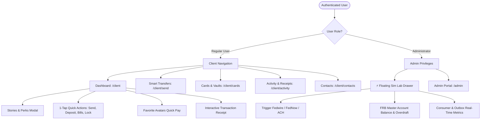

# Specification: Plata & Tinkoff Pure Neobank UX/UI Architecture for KarinBank

**Document ID:** `SPEC-2026-08-22-NEOBANK-UX-UI`  
**Date:** 2026-08-22 (Updated: 2026-09-02)  
**Status:** Implemented & Deployed to Production  
**Target Platform:** Next.js 15 (React 19), Tailwind CSS, Framer Motion, Lucide Icons  

---

## 1. Executive Summary & Goals

This specification details the comprehensive front-end UX/UI transformation of **KarinBank** into a world-class digital neobank, drawing inspiration from **Tinkoff Bank** and **Plata Bank (Mexico)**, adapted specifically for the United States financial ecosystem (Fedwire RTGS, FedNow 24/7 instant settlement, FedACH, Checking/Savings Vaults, 9-digit ABA Routing Number validation).

### Key Objectives:
1. **Clean, Frictionless Neobank Experience:** Eliminate dashboard clutter; deliver an intuitive, rapid, and aesthetically stunning banking interface with rich micro-interactions.
2. **Preserve Signature Glassmorphism Aesthetic:** Maintain the deep obsidian/indigo space theme (`#050510` background, `backdrop-filter: blur(24px)`, subtle purple/indigo and emerald glows) with refined contrast and visual depth.
3. **Smart Universal Payments & Transfers:** Implement a unified smart input for P2P, Fedwire, FedNow, and bill payments with real-time routing lookup and fee transparency.
4. **Strict Role-Based Isolation:** 
   - **Regular Users (`role: "user"`):** Pure, distraction-free consumer neobank experience without any debug tools or simulation banners.
   - **Administrators (`role: "admin"`):** Access to the floating `⚡ Sim Lab` drawer, Federal Reserve Master Account liquidity monitor, Kafka/ClickHouse telemetry, and live payment scenario injection.

---

## 2. Information Architecture & Navigation



### Navigation Structure
- **Desktop Sidebar:** Sticky, refined glass sidebar with logo, account switcher, and active route indicator pills.
- **Mobile Bottom Navigation Bar:** Clean 4-tab bar (`[Home]`, `[Transfers]`, `[Cards]`, `[Activity]`) with subtle haptic tap animations.
- **Header:** Personalized greeting, notification bell with unread indicator, and profile/security badge.

---

## 3. Detailed Component Specifications

### 3.1. Stories & Financial Highlights Bar (`StoriesBar.tsx`)
Positioned prominently at the top of the client dashboard:
- **Interactive Story Chips:**
  1. 📈 **High-Yield Vaults:** *"Earn 4.85% APY on Savings"*
  2. ⚡ **FedNow Instant 24/7:** *"Zero-fee instant settlement day and night"*
  3. 💳 **Smart Cashback:** *"Up to 3% back on dining and daily essentials"*
  4. 🛡️ **FDIC Protection:** *"Direct deposits protected up to $250,000"*
  5. 📊 **Weekly Spending Pulse:** *"Smart breakdown of category expenses"*
- **Stories Modal Viewer (`StoryViewerModal.tsx`):**
  - Instagram/Tinkoff-style full-screen modal with timed progress bars (5s per slide).
  - High-impact graphic cards with vibrant gradient backdrops.
  - Action button on each slide (e.g. *"Open Savings Vault"*, *"Send via FedNow"*, *"View Cashback Deals"*).

### 3.2. Account & Card Carousel (`HeroProductCarousel.tsx`)
Replaces the monolithic static balance card with a swipeable/selectable multi-product carousel:
- **Slide 1: Primary Checking Account (USD):**
  - Total Available Balance with 1-tap visibility toggle (`👁️`).
  - Account Number (`•••• 0001`) and Routing Number (`123456780`) with 1-click copy toast feedback.
  - Reserved funds indicator badge (`+$X.XX pending clearance`).
- **Slide 2: High-Yield Savings Vault (`VaultCard.tsx`):**
  - Current Savings Balance + APY percentage badge (`4.85% APY`).
  - Target savings goal progress bar with micro-animation.
- **Slide 3: KarinBank Black Platinum (`DigitalCardPreview.tsx`):**
  - Realistic card with iridescent gradient, chip, contactless indicator, and cardholder name.
  - 1-tap CVV reveal with automatic 10-second security timeout.
  - 1-tap Lock/Freeze toggle.

### 3.3. Quick Action Hub & Fast Pay Avatars (`QuickActionHub.tsx`)
Positioned directly below the hero carousel for instant accessibility:
- **4 Circular Action Buttons:**
  - `[ ↗ Send / Transfer ]`: Opens the unified Smart Transfer modal.
  - `[ + Add Funds ]`: Opens Direct Deposit details, Routing numbers, and Instant Inbound Wire instructions.
  - `[ 📄 Pay Bills ]`: Rapid bento selector for Utilities (PG&E), Mobile (Verizon/AT&T), Rent, and Subscriptions.
  - `[ 🔒 Card Controls ]`: Opens instant card limits, PIN reset, and virtual card generation.
- **Fast Pay Avatars Row (`FastPayCarousel.tsx`):**
  - Circular avatar list of recent and favorite payees (e.g. David Chen, Sarah Jenkins, Vanguard, PG&E).
  - Plus button `[+]` to add new frequent recipient.
  - Tapping any avatar immediately opens an amount input bottom-sheet pre-filled with the recipient's info.

### 3.4. Daily Activity Feed & Interactive Receipts (`DailyActivityFeed.tsx`)
A chronological, cleanly grouped transaction feed:
- **Date Separation Headers:** Sticky badges for *"Today"*, *"Yesterday"*, and full date format (`August 21, 2026`).
- **Rich Merchant List Items:**
  - Merchant logo / brand avatar (Netflix, Uber, Starbucks, PG&E, Vanguard, Apple, Fedwire Inflow).
  - Transaction category indicator (Dining, Utilities, Entertainment, Federal Settlement, P2P).
  - Clear Settlement Rail Chip:
    - `⚡ FedNow (Instant)` — Emerald green badge.
    - `🏛️ Fedwire (RTGS)` — Indigo/Blue badge.
    - `⏱️ FedACH Debit` — Amber badge.
    - `💳 Debit Card` — Purple badge.
- **Interactive Receipt Modal (`ReceiptModal.tsx`):**
  - Authentic banking receipt presentation with KarinBank digital watermark seal.
  - Full details: Amount, Timestamp, Status (`Cleared` / `Settled`), Sender & Recipient Routing/Account numbers.
  - Federal Reserve Tracking IDs: **IMAD/OMAD** (Fedwire), **End-to-End Identification** (FedNow), **Trace Number** (ACH).
  - Actions: `[Repeat Payment]`, `[Copy Reference Code]`, `[Download Receipt PDF]`.

### 3.5. Smart Transfer Hub (`SmartTransferHub.tsx` & `/client/send`)
Replaces disjointed tabs with an intelligent single-flow transfer experience:
- **Universal Input:** Accepts Recipient Name, Email, Phone, Karin Account ID, or 9-digit ABA Routing Number.
- **Real-Time ABA Directory Auto-Resolution:**
  - When 9 digits are entered: Computes Mod-10 checksum; queries `/v1/fed/directory/{routing}`; displays official institution name (e.g. *JPMorgan Chase Bank, N.A.*) and supported Fed rails.
- **Smart Rail Recommendation:**
  - Automatically recommends **FedNow** (instant, $0 fee) if both banks participate, or **Fedwire** (RTGS high-value, $15 fee) for amounts over $500,000, or standard **ACH**.
- **Keypad & Quick Chips:** Instant amount selector (`$25`, `$50`, `$100`, `$500`, `Max`).
- **Swipe / Hold to Confirm:** High-satisfaction tactile confirmation animation with celebratory confetti and receipt generation.

### 3.6. Cards & Security Hub (`/client/cards`)
- **Interactive 3D Card Visualizer:** Flip between card face (Number, Holder, Expiry) and card back (CVV, Magnetic strip, Signature panel).
- **One-Click Security Toggles:**
  - `Freeze Card` (instant lock on physical and virtual spending).
  - `Online E-Commerce Transactions` (toggle on/off).
  - `International Transactions` (toggle on/off).
  - `ATM Cash Withdrawals` (toggle on/off).
- **Spending Limit Slider:** Interactive daily and monthly limit slider with live budget utilization.
- **Generate Disposable Virtual Card:** Creates a 1-time virtual card token for safe online shopping.

### 3.7. Between-Accounts Internal Transfer Hub (`BetweenAccountsTab.tsx` & `/client/send?tab=internal`)
Designed for frictionless movement between a customer's own checking, sub-accounts, and savings vaults:
- **Bi-Directional Account Selector:**
  - Source account selection with real-time Available Balance check.
  - Destination account selection with current balance and validation preventing identical source/destination.
  - Interactive Swap Direction button with 180° rotation Framer Motion transition.
- **Quick-Amount Chips & Max Fill:** Instant buttons for `$25`, `$50`, `$100`, `$250`, `$500`, and `Max Available`.
- **Compounding APY Banner:** Automatically displays an alert when moving funds into high-yield vaults (`"Deposited funds automatically accrue 4.85% APY compounded daily and backed by KarinBank Treasury"`).
- **Endpoint:** Integrates with backend `/api/v1/accounts/transfer/internal` via `createInternalTransfer()`.

### 3.8. High-Yield Vault Direct Management (`VaultTransferModal.tsx`)
1-tap modal overlay for dedicated vault management:
- **Instant Access Points:** Direct triggers from `VaultCard` ("Deposit" and "Withdraw" buttons), `StoriesBar` ("4.85% APY Vaults" story slide CTA), and `QuickActionHub`.
- **Mode Switching:** Tabbed toggling between **Deposit** (Primary Checking → Vault) and **Withdrawal** (Vault → Primary Checking).
- **Yield Calculation:** Live yield breakdown displaying daily compounding and annual APY returns before confirmation.

### 3.9. Transaction Settlement Engine & Outbox Status Preservation
- **45-Second Auto-Settlement Worker (`backend/sync_checker.py`):** Background worker running on a 15s cadence; queries pending/processing transactions older than 45 seconds and transitions them to `cleared` while enqueuing `transaction.status_update` outbox events.
- **Terminal Status Preservation (`backend/outbox_service.py`):** Ensures that already cleared or settled transactions are never overwritten or downgraded to internal Kafka states, and actively moving transactions register as `processing`.
- **Professional Banking Presentation:** User-facing UI displays authentic banking statuses (`Cleared`, `Settled`, `Processing`) instead of internal engineering terms (`sent_to_kafka`), and `ReceiptModal` displays complete, untruncated transaction reference IDs.

---

## 4. Admin-Exclusive Features: `⚡ Sim Lab` Drawer & Governance

### 4.1. Role Enforcement
```typescript
// Guard: Only render SimLabDrawer and admin actions if user has 'admin' role
const { user } = useAuth();
const isAdmin = user?.role === 'admin';
```
- For standard users (`role === 'user'`), zero simulator artifacts, developer buttons, or debug floating elements are mounted to the DOM.

### 4.2. Floating `⚡ Sim Lab` Drawer (`SimLabDrawer.tsx`)
- Fixed bottom-right trigger pill: `[⚡ Sim Lab]` with a pulse indicator.
- Slide-over glass sheet with tabbed developer tools:
  1. **Federal Reserve Master Account:** Live balance ($10,000,000.00), available liquidity, daylight overdraft utilization, and rail volume meters.
  2. **Scenario Injector:** 1-click execution of simulated events:
     - `Trigger FedNow Instant Payment` ($25.00 – $5,000.00).
     - `Trigger Fedwire RTGS Inflow` ($50,000.00 – $2,500,000.00).
     - `Trigger FedACH Utility Direct Debit` ($75.00 – $350.00).
     - `Trigger Full Daily Economic Cycle`.
  3. **Event Streaming Telemetry:** Kafka Outbox buffer state, consumer batch throughput, and ClickHouse table row counts.
  4. **State Reset & Seed:** Re-seed demo database with authentic historical transaction records.

---

## 5. Visual Tokens & Styling Rules

```css
/* Core Design Tokens */
:root {
  --bg-space: #050510;
  --bg-surface: rgba(16, 18, 35, 0.70);
  --bg-elevated: rgba(26, 29, 58, 0.85);
  --border-glass: rgba(255, 255, 255, 0.08);
  --border-focus: rgba(139, 92, 246, 0.50);
  
  --accent-purple: #8b5cf6;
  --accent-indigo: #6366f1;
  --accent-emerald: #10b981;
  --accent-rose: #ef4444;
  --accent-amber: #f59e0b;
  --accent-cyan: #06b6d4;
}
```

---

## 6. Verification & Testing Strategy

1. **Component Unit & Integration Tests (`Jest` / `React Testing Library`):**
   - Verify `StoriesBar` renders all 5 stories and opens `StoryViewerModal` on click.
   - Verify `HeroProductCarousel` displays Checking, Vaults, and Cards correctly.
   - Verify `SmartTransferHub` performs real-time ABA routing lookup and auto-selects FedNow/Fedwire rails.
   - Verify `ReceiptModal` extracts IMAD/OMAD, End-to-End IDs, and formats currency accurately.
   - Verify `SimLabDrawer` is **strictly hidden** when `user.role === 'user'` and visible when `user.role === 'admin'`.
2. **TypeScript Strict Type Checking:** `npx tsc --noEmit` passing with 0 errors.
3. **End-to-End Automated Browser Testing:**
   - Test login as regular user -> verify dashboard is clean, fast pay works, transfer flow executes, receipt opens.
   - Test login as admin -> verify `⚡ Sim Lab` trigger is present, trigger FedNow/Fedwire scenarios, observe live balance update.

---

## 7. Spec Self-Review Checklist
- [x] **Placeholder Scan:** No TBD, TODO, or uncompleted sections.
- [x] **Internal Consistency:** Clear mapping between components, data flows, and role guards.
- [x] **Scope Check:** Well-scoped, modular Next.js frontend components ready for systematic subagent implementation.
- [x] **Ambiguity Check:** Explicit definitions for colors, responsive layouts, API endpoints, and user role restrictions.
